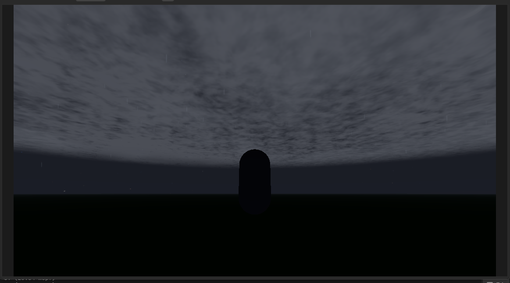

# Dynamic Weather Plugin for Godot 4

A lightweight, precipitation‑driven dynamic weather system that adds realistic clouds,
rain, snow, thunder, lightning, and fog to your 3D Godot projects.

## Features

- **4 procedurally generated cloud layers** – nimbostratus, stratus, cumulus, altocumulus
- **Rain & snow particle systems** – fully automatic, follow the player, intensity blends smoothly
- **Thunder & lightning** – audio and visual flashes triggered during heavy storms
- **Dynamic fog overlay** – reduces visibility during heavy precipitation
- **Day/night cycle** – clouds and fog darken at night, respond to the sun direction
- **Automatic setup** – all nodes find their dependencies without manual wiring
- **Customisable** – every visual parameter exposed in the Inspector with tooltips

## Installation

1. Download or clone this repository.
2. Copy the `addons/Dynamic Weather` folder into your Godot project’s `addons/` directory.
3. Open your project in the **.NET** version of Godot 4.6 (or later).
4. Go to **Project → Project Settings → Plugins** and enable **Dynamic Weather Plugin**.
5. Drag the `weather_system.tscn` scene (inside `addons/Dynamic Weather/scenes/`) into your main scene.
6. Run your game – the weather will automatically start changing.

> **Note:** This plugin requires the **.NET** (Mono) version of Godot because it contains C# scripts.

##  Quick Start <OPTIONAL>

1. Add your player node to the scene. The rain and snow systems will automatically find it if the node is named `Player` (any casing).
2. Add a `DirectionalLight3D` node for the sun – the cloud shaders will find it automatically.
3. (Optional) Add a `WorldEnvironment` node if you don’t already have one – the fog and cloud dimming will use it.
4. Press play and watch the weather evolve! You can tweak cloud types, rain amount, snow coverage, thunder frequency, and more in the Inspector.

##  Cloud Types

| Cloud | Description |
|-------|-------------|
| **Nimbostratus** | Thick, dark storm clouds that dim the environment and bring heavy rain. |
| **Stratus** | Flat, grey overcast sheets with soft edges and drifting holes. |
| **Cumulus** | Puffy, billowy clouds that float at medium altitude. |
| **Altocumulus** | Smaller, grouped popcorn‑like clouds with wind‑driven movement. |
| **Cirrus** | Wispy high‑altitude clouds (rendered in the sky shader). |

## Weather Cycle

The weather is driven by a noise‑based cloud orchestrator that smoothly transitions between:

- Clear / partly cloudy
- Light rain or drizzle
- Heavy rain / thunderstorms (with thunder & lightning)
- Snow (with accumulation on the ground via a snow accumulator)
- Mixed rain & snow (wintry mix)

All transitions are smoothed over time, and the weather never repeats – the noise seed ensures endless variation.

## Customization

Every cloud type has its own Inspector section with parameters like:

- Coverage speed, precipitation darkening, edge softness
- Wind speed & direction
- Puff scale, contrast, warp strength
- … and many more – all documented with tooltips.

You can create your own weather states by editing the `WeatherState` resource.

## 📁 Project Structure
addons/
└── Dynamic Weather/
├── plugin.cfg
├── plugin.gd
├── weather_state.cs
├── weather_manager.cs
├── cloud_ochestrator.gd
├── base_cloud_controller.gd
├── nimbostratus.gd
├── stratus.gd
├── cumulus.gd
├── altocumulus.gd
├── fog_volume.gd
├── rain.gd
├── snow.gd
├── thunder_controller.gd
├── rain_audio_controller.gd
├── moon.gd
├── sun.gd
├── storm_overlay_fog.gd
├── shaders/
│ ├── nimboStratus_shell.gdshader
│ ├── stratus_shader.gdshader
│ ├── cumulus_shader.gdshader
│ ├── altocumulus.gdshader
│ ├── fog_volumee.gdshader
│ ├── rain_streak.gdshader
│ └── snow_flake.gdshader
├── scenes/
│ └── weather_system.tscn
└── audio/
├── thunder1.ogg
├── thunder2.ogg
├── rain_light.ogg
└── rain_heavy.ogg

## License

This project is licensed under the MIT License – see the [LICENSE](LICENSE) file for details.

